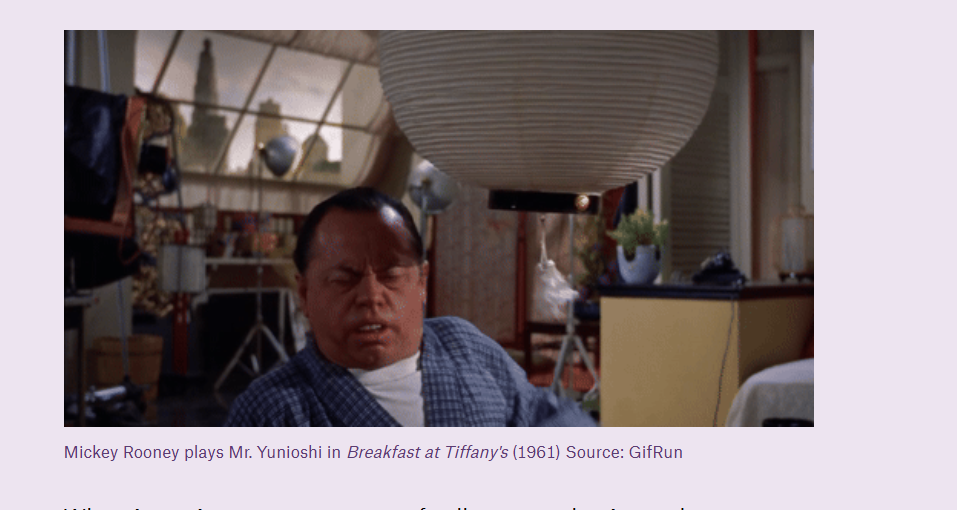
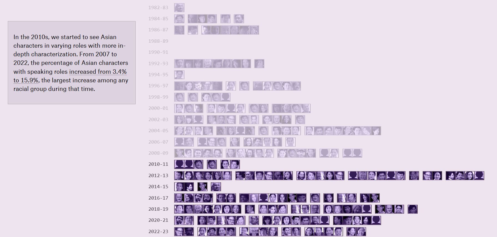
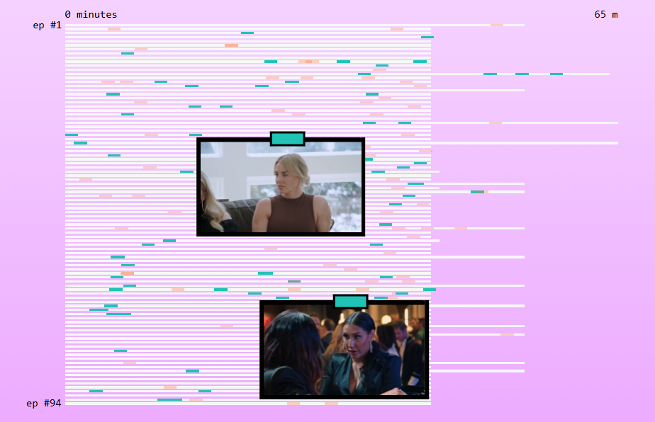

## Análisis individual: Martina Astargo ##
Crecí viendo teleseries, sola o junto a mi familia, sobre todo con mujeres. Para mí, el tema de la representación de la mujer en las teleseries es muy relevante, considerando que la mayoría de productores de telenovelas son hombres y los directores del área dramática también lo son. Es un espacio que han podido ir tomando las mujeres en los últimos años, no solo en la dirección, sino también en la relevancia de la historia. 

Mostrar en televisión abierta, en una teleserie que se transmite en horario de tarde, a una mujer empoderada, autónoma, independiente económicamente, que muestre sentimientos no siempre buenos, sino que enojo, tristeza, etc. puede enseñar o mostrar una realidad mucho mayor que una mujer que vive encerrada, infeliz, que su marido no la respeta, que se pelea con otras mujeres, etc. Estos dos tipos de mujeres pueden estar presentes en las teleseries, pero los valores que muestran son totalmente distintos. La niña o adolescente que crece con esto, también marca y la forma en su pensamiento y creo que es deber, como periodistas, también investigar y ahondar en estas formas sutiles de enseñar valores o normalizar situaciones. 

Considerando eso, es también porque me gustaría hacer una página web tan visual, para que todo público pueda entenderlo y verlo, sin tener que leer mucho, sino que la información sea entregada de forma simple y visual. 

Con este tema, me gustaría poder dar cuenta del problema de los estereotipos que aún vivimos en la televisión abierta, pero también, demostrar los cambios y avances que han ocurrido. Poder celebrar a esas actrices protagonistas de tramas no siempre amorosas, o no siempre trágicas. También, de notar esas teleseries que, para su tiempo, se atrevieron a mostrar hechos fuera de la cotidianeidad o de lo que se esperaba. 

El tema de las teleseries denunciadas en el Consejo Nacional de Televisión, también es relevante, porque demuestra que hay un cambio de mentalidad, que lo antes “normalizado” ya no lo es y que, como la sociedad cambia, entonces las teleseries también lo deberían hacer. 

**Mis 3 ideas para inspirarme son las siguientes:** 

Me encantaría poder incluir gifs, que hagan todo más entretenido de ver y que puedan reflejar ciertas escenas esenciales para nuestro análisis. 

Además, este gráfico lo encontré muy útil para nuestro tema, si es que queremos mostrar cuántas mujeres han sido protagonistas de distintas teleseries. 

Por otra parte, está forma de gráfico también me llamó la atención, porque podríamos escoger un capítulo de una teleserie muy vista y evaluar: cuántas veces la mujer pidió perdón, cuántas veces la mujer quedó sola, cuántas veces el hombre la infravaloró, etc. 

Además, puede servir para mostrar cuántas veces la mujer tuvo que decir que no, cuántas veces la sexualizaron, etc. 

