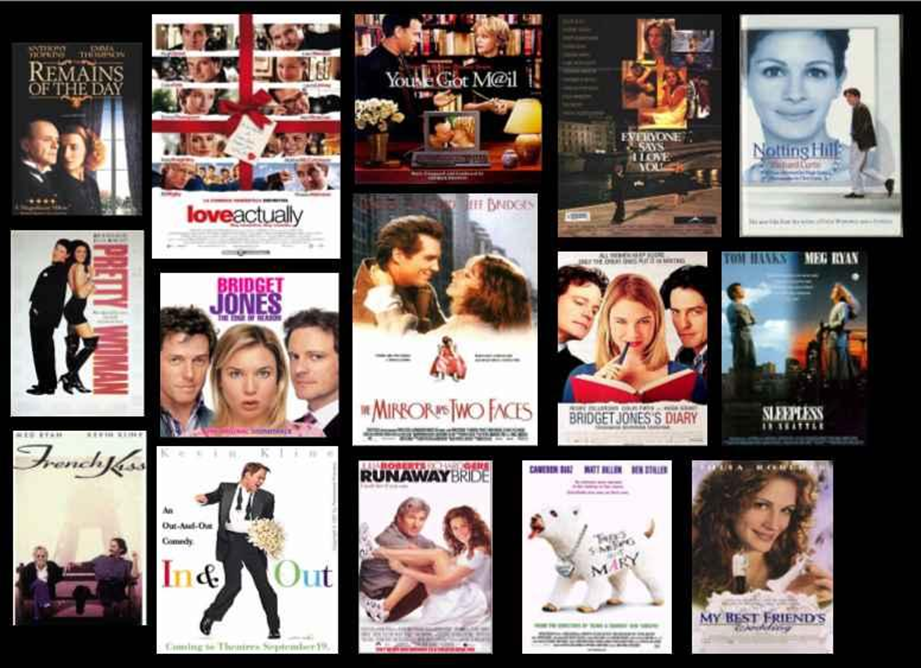
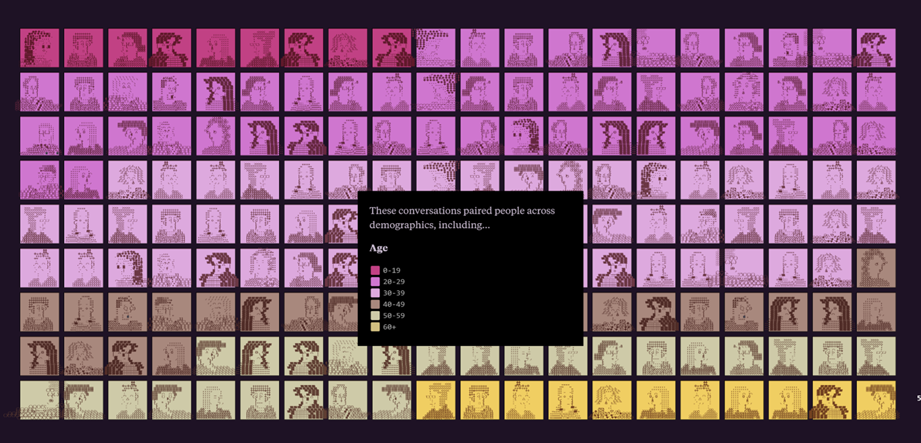

## Análisis individual: Merlina Cerda ##

Me considero una persona muy consumidora de teleseries chilenas. Desde pequeña tengo la costumbre de sentarme con mi familia a ver las novelas de la tarde durante el almuerzo, y más tarde, cuando tomábamos once. Aunque verlas es costumbre para mí, creo que han sido pocas las veces en que me he detenido a cuestionar cómo se representan ciertos personajes o elementos de la trama.

Cuando comenzamos a pensar, junto a mi compañera Martina, en posibles temas para un reportaje, se nos ocurrió abordar las teleseries, ya que ambas compartimos ese gusto. Partimos conversando sobre personajes icónicos y algunas tramas, y finalmente revisamos los posters oficiales de las producciones que conocíamos. Me resultó incómodo ver algunas imágenes en las que las mujeres aparecían con poca ropa y eran observadas por personajes masculinos. A partir de eso, no pude dejar de reflexionar sobre la representación de la mujer en estas ficciones y los estereotipos que presentan.

Con nuestro reportaje esperamos mostrar que, si bien las teleseries han avanzado en la manera en que representan a las figuras femeninas, dándoles más seguridad e independencia, aún persisten estereotipos que siguen marcando a nuestra sociedad. La imagen de la mujer dependiente afectivamente de un hombre sigue presente. Además, se sigue dejando fuera a cierto grupo de población: mujeres mayores, con características físicas diversas, protagonistas de tez más oscura, entre otras. Queremos que nuestro trabajo genere un impacto en quienes lo lean y los invite a ser más críticos respecto al contenido que consumen como entretenimiento.

A medida que avanzaba la investigación, se me ocurrían ideas sobre cómo quería que se viera el reportaje. Creo que incluir los posters es fundamental. Me gustaría hacer un collage con los de las teleseries más exitosas, para mostrar qué tipo de representación femenina predomina en las novelas más vistas y cuáles patrones se repiten. También hacer otro collage con las teleseries menos vistas, para analizar si la forma en que se retrata a las mujeres pudo haber influido en su recepción.

A partir de los collages, sería interesante crear una línea temporal que ilustre los cambios en las portadas y en la representación femenina a lo largo del tiempo. Creo que el reportaje tiene mucho potencial de ser visualmente atractivo al incluir varias imágenes, lo que permitiría también incorporar gráficos más tradicionales que destaquen la evolución de las tramas y los estereotipos.

Además, me gustaría generar una nube de palabras con los estereotipos más repetidos y las tramas a las que suelen estar vinculadas las mujeres, integrándola en la silueta femenina de manera creativa.

