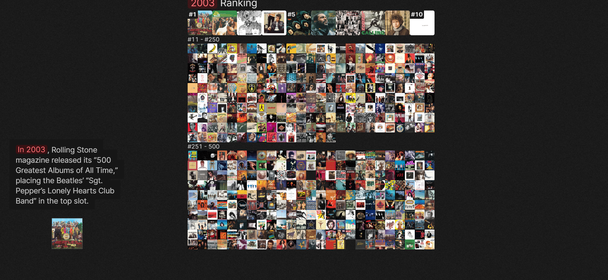
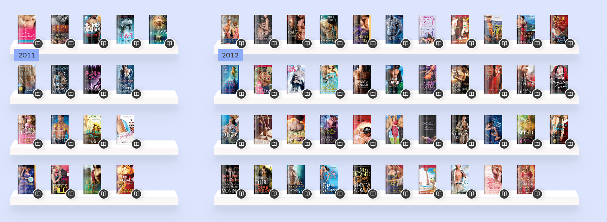

## Presentación proyecto webstory ## 

Las teleseries en Chile han sido uno de los productos culturales más influyentes en la identidad nacional. Las tramas, los personajes y la representación de la población, han reflejado ideas y realidades sobre el amor, la familia y las clases sociales. En este sentido creemos que es importante analizar cómo ha evolucionado la representación femenina en las ficciones chilenas, permitiendo comprender las transformaciones culturales que hemos vivido como sociedad.  

Este proyecto propone un reportaje de datos que abarcará las teleseries chilenas desde 1967 hasta la actualidad, con foco en la representación y protagonismo femenino. Para esto utilizaremos una base de datos construida por nosotras considerando los éxitos de audiencia de las teleseries, en qué año se produjo, cuántas salieron al año. Todo esto con los cuatro canales (Chilevisión, Canal 13, TVN y Mega). Eso nos va a permitir identificar patrones en los títulos y protagonistas, en la representación y contrastar como han cambiado a lo largo del tiempo, además comparar el por qué los grandes éxitos de cada canal. 

En el comienzo, los roles femeninos en las teleseries chilenas solían estar vinculados a la maternidad y la vida doméstica. Además, en los posters promocionales, por ejemplo, se puede notar una hipersexualización de la mujer, al igual que en los títulos de las teleseries. Ya en los 80 y 90, si bien el panorama se veía un poco parecido, se dio vida a personajes femeninos más autónomos y complejos, en el sentido de tener una historia detrás, personalidades rebeldes, confrotacional, etc. En la actualidad podemos notar que la mujer se muestra más empoderada, segura, independiente económica y afectivamente. Su protagonismo no dependía necesariamente de su cuerpo o sexualización, sino que de su inteligencia, trabajo o independencia. Sin embargo, aun su rol se ve estereotipado, o en busca de un hombre que la proteja.  

La propuesta, por lo tanto, es realizar un reportaje de datos que no solo describa cifras y tendencias, sino que también exponga, de manera gráfica y visual, cómo se ha construido la representación de la mujer en la televisión chilena. 

Nuestra hipótesis es: La representación estereotipada y secundaria de las mujeres chilenas en las teleseries ha disminuido a lo largo de los años, pero aún mantiene la necesidad de dependencia y protección masculina.  

Esto se basa en dos análisis. En la Universidad de Valparaíso se publicó una tesis que aborda teleseries como: La Fiera, Romané y El circo de las Montini. Y señalan que: “Además de mostrar mundos ficcionales particulares y acabadamente presentados, podemos ver en ellas a heroínas que son mujeres empoderadas, independientes y con opinión fundamentada, por lo que postulamos que contribuyeron a desmantelar el estereotipo clásico de la mujer en la telenovela chilena”. Se hace una comparación con el teatro de los 90, y los roles que tenían las mujeres. En la tesis se señala este avance en la representación de la mujer, que se puede visualizar en esas teleseries, sobre todo, por la actitud y personalidad de los personajes. Por ejemplo, en La Fiera, se ve una mujer que golpea al hombre, le grita, y también lo busca para quedarse con él. En este sentido, su rol toma un protagonista que antes se podía ver más en el hombre.  

Por otra parte, el Consejo Nacional de Televisión (2020) realizó una encuesta para analizar la masividad que tienen las teleseries. Considero la opinión de las mujeres y hombres sobre si se sienten representados como audiencia, enfocándose sobre todo en el público femenino, La investigación incluyó a las producciones ‘La reina de Franklin’ y ‘Pacto de sangre’ (de Canal 13) e ‘Isla Paraíso’ y ‘Casa de muñecos’ (de Mega), que reveló que, “aunque las producciones muestran una evolución en los roles femeninos, representando a una mujer más independiente y ligada al mundo laboral, los personajes siguen creando estereotipos: la mayoría de los roles femeninos dependen afectivamente (y a veces económicamente) de los hombres y, además, las protagonistas son, en general, mujeres jóvenes, casi siempre delgadas y de rasgos caucásicos. En el caso de los hombres, el modelo de personaje rubio de ojos claros se da también en la TV y publicidad”. Esto se relaciona directamente con nuestra hipótesis que señala que hoy en día, pese a los avances en los otros estereotipos, sigue habiendo estigmas en las mujeres sobre cómo se ven y qué esperan del hombre afectiva y económicamente.  

Además, analizó en la presencia de mujeres y hombres en los elencos, la cual se señala como equitativa. En ‘La reina de Franklin’, el 54% de los personajes eran femeninos y el 46%, masculinos; en ‘Pacto de sangre’, el 53% de los roles lo tenían los hombres y el 47%, las mujeres; en ‘Isla Paraíso’, los porcentajes eran 50% y 50% para cada género, y en ‘Casa de muñecos’, la división del elenco era de 48% de hombres y 52% de mujeres. 

Comparándolo con las teleseries antiguas, las mujeres ya no son solo coprotagonistas o personajes secundarios, sino que han tomado roles protagónicos y cuentan con una historia e importancia durante la trama.  

Los datos que ya recopilamos en nuestro Excel eran públicos y muestran la cantidad de teleseries que produjo cada canal televisivo (Mega, Canal 13, TVN y Chilevisión), la audiencia que tuvo (considerando premios, puntos de audiencia y rating); cantidad de episodios y años de emisión. Los datos que nos faltaría y que no existen serían: categorías de temáticas de cada teleserie, los protagonistas y coprotagonistas (mujeres u hombres) y los estereotipos asociados. Esto lo filtraremos nosotras según análisis de cada teleserie, evaluando la trama y los personajes. Además, recopilaremos todos los pósteres o presentaciones de las telenovelas.   

En las teleseries más antiguas, de los 70 u 80, no contaban con una medición de audiencia, por lo que no son 100% confiables, ya que son suposiciones o investigaciones de personas. Además, los puntos de audiencia o rating van variando, dependiendo del mes, del día o del capítulo que se emitió o emite.  

Algunas de las preguntas que se pueden responder con los datos recopilados son: ¿Cómo ha cambiado la representación de la mujer en las teleseries chilenas desde los años 70 hasta la actualidad?, ¿Qué estereotipos se repiten con mayor frecuencia en los personajes femeninos?, ¿Qué diferencia hay entre los roles femeninos y masculinos en su protagonismo?, ¿Hay diferencias en la representación de las mujeres según su edad o clase social, por ejemplo?, ¿Se mantienen los estereotipos físicos?, ¿Ha cambiado la trama de las teleseries?, ¿Los pósteres o publicidades donde se muestra la mujer de la historia, sigue siendo igual?, ¿La audiencia varía según la trama de la teleserie?  

La historia de nuestro proyecto de investigación se relaciona con: cómo se ha representado a las mujeres en las teleseries chilenas a lo largo de los años. En las primeras novelas destacaban los estereotipos como el de la mujer más sumisa, dedicada al hogar y muy dependiente de la figura masculina. Ya en los 90, se incorporan personajes femeninos más complejos, por ejemplo, La fiera de TVN, mostraba a una mujer rebelde, peleadora, que tenía sus ideales claros y que buscaba al hombre al final.  

Queremos dar un recorrido hasta llegar a la actualidad, y demostrar que si bien se han cambiado un poco las narrativas para reflejar una realidad donde la mujer cada vez se empodera más, sigue habiendo muchos estereotipos cuando se abordan personajes femeninos de clase alta, clase más pobre, personal de aseo, entre otras. Además, se siguen invisibilizando a algunos grupos: adultas mayores, mujeres con características físicas distintas a los estándares de belleza, etc.  

Para lograr una narrativa potente, queremos incorporar todos los afiches de las teleseries en un collage, para así mostrar muy visualmente la representación de la mujer, los estereotipos y también el nivel de sexualización del personaje femenino. 

En el reportaje de The Pudding “¿Qué hace que un álbum sea el mejor de todos los tiempos?” se analizan los factores que contribuyen a que un álbum de música sea el mejor. Se exploran elementos como la longevidad de un álbum en una lista, la cantidad de menciones, la diversidad de géneros y a través de visualizaciones y gráficas armadas con las mismas portadas de los álbumes se entregan los datos. Creemos que nuestra historia tiene mucho potencial para ser contada visualmente, ya que los posters de las telenovelas chilenas son muy explícitos en los estereotipos que incluyen.  

En el reportaje “Portadas de novelas románticas” del mismo sitio, se narra la historia de cómo han cambiado las portadas de las novelas románticas a través de los años. Utiliza herramientas similares al artículo anterior y sigue la misma lógica de compartir la narrativa a través de imágenes. Nos gustaría lograr algo así, una línea temporal que ilustre los cambios en la representación de la mujer. 

También queremos categorizar cada teleserie, además de su éxito e impacto, según su trama y profesión del personaje femenino principal. Con esto nos gustaría crear una nube o ilustración con los estereotipos más populares en las teleseries.  

Lo mínimo que se puede contar con los datos que vamos a recopilar son los estereotipos femeninos que predominan en las teleseries chilenas. También podemos hacer una comparación histórica sobre cómo ha cambiado la representación desde 1970 hasta ahora. Podemos lograr una narrativa con imágenes y gráficos más simples que nos ayuden a ilustrar los datos.  

Respecto al máximo, creemos que podemos lograr crear reportaje completo y detallado incluyendo una línea temporal, con los cambios en los estereotipos, la relación entre el éxito que tiene una teleserie según como se representó a la protagonista femenina, la época de oro de los canales de televisión y cómo influyó el protagonismo o personaje de la mujer. En Chilevisión, por ejemplo, las teleseries más vistas fueron “La sexóloga” y “Mujeres de Lujo”, donde los personajes femeninos generalmente se muestran con menos ropa y tocaban temas sexuales. Nos gustaría lograr evaluar las diferencias en las teleseries de los distintos canales (T13, CHV, Mega y TVN), descubrir cuál tuvo más éxito, por qué, evaluar cómo acostumbraba a mostrar a las mujeres, etc. Visualmente queremos lograr entregar los datos de manera muy gráfica, a través del collage de posters y analizar los patrones de cada producción.  

Nuestros enlaces de información:  
https://repositoriobibliotecas.uv.cl/items/849fe9bb-fdff-420d-8389-484cf6fc831a?utm_source=chatgpt.com
https://cntv.cl/2020/01/teleseries-crean-estereotipos-femeninos-segun-estudio-del-cntv/?utm_source=chatgpt.com

